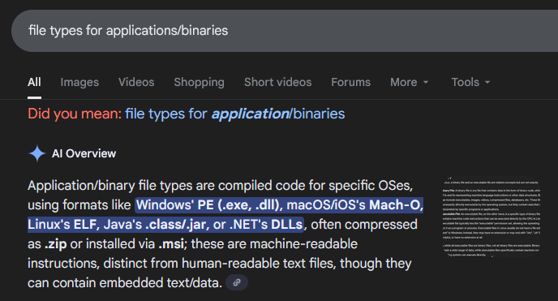
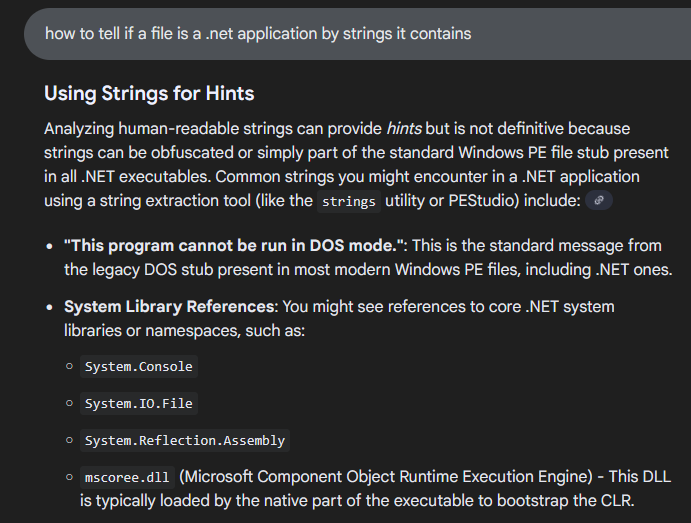
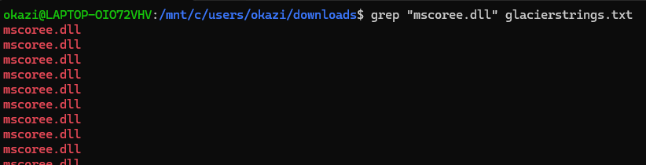
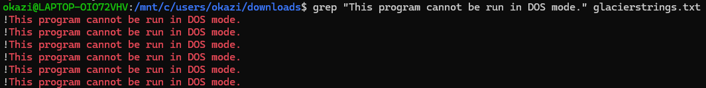
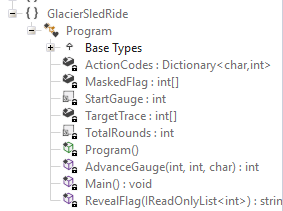

**WinterCTF 2025**

**Challenge:** Glacier Sled Ride

**Category:** Reverse Engineering

**Flag:** ``winterctf{h0_h0_h0_m3rry_chr157m45}``

I participated on my own in this CTF and got 1st place!

We're given a binary, ``glacier_sled_ride``.

The first thing I did was decompile it using Ghidra, which took a very long time.
When it finally finished, I was presented with a whole lot of nothing.

After digging around in Ghidra for a while, I realized that *maybe* this isn't what you're meant to do.
So I did a Google search:


Hmmm...
Well, it's not a .exe, or a .dll, and we already tried handling it like an ELF by decompiling it.
It's also probably not a Mach-O or a Java file.

However, .NET looks interesting. Let's do another quick search.


Ok, seems straightforward enough. I ran the command:
``strings glacier_sled_ride > glacierstrings.txt``

And grepped it for one of the strings I found in the Google search:


That's promising, but it could still be something else.
Let's try something more specific:


Ok, that confirms it. This file is a .NET application.

Now, I will be honest:
I spent an embarassing amount of time installing tool after tool to try to extract this.

I tried dotnet extract, I tried dotnet-extract, and I tried the other dotnet-extract.
I even tried the dotnet extract on an older version of the .NET SDK.

The one that finally worked was sfextract! I ran this command to extract the .dlls:
``sfextract glacier_sled_ride -o glacier_output``

There were lots of dlls in ``glacier_output``, but the one that stuck out to me was ``GlacierSledRide.dll``.

Opening that with ILSpy, we can see the logic and classes in the assembly!



First, let's look at the main method:
```
private static void Main()
{
    Console.WriteLine("Glacier Sled Ride Console");
    Console.WriteLine("Guide the sled for a dozen hills. Choose (l)eft, (c)enter, or (r)ight each turn.");
    int[] array = new int[12];
    int num = 64;
    for (int i = 0; i < 12; i++)
    {
        Console.Write($"Hill {i + 1} path: ");
        string text = Console.ReadLine()?.Trim().ToLowerInvariant();
        if (string.IsNullOrEmpty(text) || text.Length != 1 || !ActionCodes.ContainsKey(text[0]))
        {
            Console.WriteLine("The sled steers in an unknown direction!");
            return;
        }
        num = AdvanceGauge(num, i, text[0]);
        array[i] = (num ^ ((i * 17 + 41) & 0xFF)) & 0xFF;
        Console.WriteLine($"Route marker: {num}");
    }
    if (((ReadOnlySpan<int>)array).SequenceEqual((ReadOnlySpan<int>)TargetTrace))
    {
        Console.WriteLine("You've reached the end! Flag: " + RevealFlag(array));
    }
    else
    {
        Console.WriteLine("The sled veers off course and crashes. Game over!");
    }
}
```

Interestingly, ``0xFF`` ensures the result is in byte range.

The flag is only revealed if your array is equal to TargetTrace, which we can find in the disassembly to be:
``161, 208, 105, 22, 207, 151, 184, 241, 46, 44, 234, 100``

Let's look at the RevealFlag method:
```
private static string RevealFlag(IReadOnlyList<int> log)
{
    char[] array = new char[MaskedFlag.Length];
    for (int i = 0; i < MaskedFlag.Length; i++)
    {
        int num = log[i % log.Count];
        int num2 = ((MaskedFlag[i] ^ num) - i * 3) & 0xFF;
        array[i] = (char)num2;
    }
    return new string(array);
}
```
MaskedFlag can be found in the disassembly just like TargetTrace:
```
    214, 188, 29, 107, 190, 22, 205, 120, 80, 186,
    108, 53, 34, 95, 51, 154, 87, 244, 45, 87,
    65, 157, 94, 218, 6, 126, 223, 213, 74, 27,
    41, 59, 186, 180, 9
```
Log will always be TargetTrace, so we can just replace that in our reversing.

Now it's as easy as retyping the RevealFlag method knowing MaskedFlag and log (TargetTrace).
Here's the python code I used:
```
MaskedFlag = [214, 188, 29, 107, 190, 22, 205, 120, 80, 186,
    108, 53, 34, 95, 51, 154, 87, 244, 45, 87,
    65, 157, 94, 218, 6, 126, 223, 213, 74, 27,
    41, 59, 186, 180, 9]

TargetTrace = [161, 208, 105, 22, 207, 151, 184, 241, 46, 44,
    234, 100]

flag = []

for i in range(len(MaskedFlag)):
    num  = TargetTrace[i % len(TargetTrace)]
    num2 = ((MaskedFlag[i] ^ num) - i * 3) & 0xFF
    flag.append(chr(num2))

print("".join(flag))
```

Running this, we get the flag:
``winterctf{h0_h0_h0_m3rry_chr157m45}``

<del>thankyouandrewfornotmakingthisabout67</del> Cool rev challenge!
