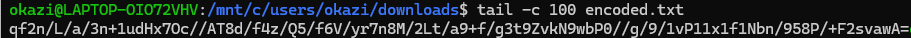
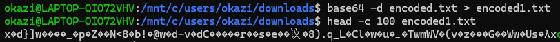
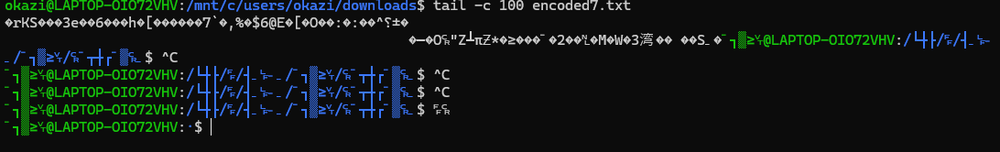

**WinterCTF 2025**

**Challenge:** Quad-Encoding

**Category:** Reverse Engineering

**Flag:** ``winterctf{s1xty_s3v3n}``

I participated on my own in this CTF and got 1st place!

We are given ``encoded.txt``, a very long .txt file that I will spare you from.

The description is important for this challenge:
"had a little fun encoding using <u>four different methods...</u>"

Ok, now we know that whatever was done with ``encoded.txt`` only used four unique encoding methods.

Immediately, I found a sign of Base64 encoding at the end of ``encoded.txt``:


That `=` is a sign of Base64 encoding.

Let's decode it using this command:
```
base64 -d encoded.txt > encoded1.txt
```

After decoding it, I got some weird characters:


Well, that's weird. Let's check the magic bytes.
```
okazi@LAPTOP-OIO72VHV:/mnt/c/users/okazi/downloads$ xxd -l 16 encoded1.txt
00000000: 789c 647d 5d77 daca d2f4 5fb2 70c8 5ab9  x.d}]w...._.p.Z.
```

``78 9c`` - those are the magic bytes in a zlib compressed data stream.

Let's decompress it using ``zlib-flate``:
```
cat encoded1.txt | zlib-flate -uncompress | tail -c 100
Uk5NVTU2U1RKYVJFcHBUakpGZVZwcVl6Uk9hbGt3VFdwS2JVMTZaekpPYWswd1RYcEZNRnBVWkdoT2Vsa3hUVlJPYTAweVVUMD0=
```

That looks like Base64 again, so let's decode it... again...
```
base64 -d encoded2.txt > encoded3.txt
tail -c 100 encoded3.txt
VTFOVE15TlRFMU5qTTBOek0zWVRNMU56STJaREppTjJFeVpqYzROalkwTWpKbU16ZzJOak0wTXpFMFpUZGhOelkxTVROa00yUT0=
```

Even more Base64... once more!!
```
base64 -d encoded3.txt > encoded4.txt
tail -c 100 encoded4.txt
NjQ0ZDczNzc1Nzc0NDE0MjZmNmU1NTMyNTE1NjM0NzM3YTM1NzI2ZDJiN2EyZjc4NjY0MjJmMzg2NjM0MzE0ZTdhNzY1MTNkM2Q=
```

This is just perfect. Again!
```
base64 -d encoded4.txt > encoded5.txt
tail -c 100 encoded5.txt
61314469727665706a5a356d2b644d7377577441426f6e5532515634737a35726d2b7a2f7866422f386634314e7a76513d3d
```

By god. It's different. Now it's hexadecimal. Let's decode it:
```
xxd -r -p encoded5.txt > encoded6.txt
tail -c 100 encoded6.txt
YLcOLCWBJDZARfNbxU/X3zqOOp4ZB5teGmfPDMZxl09kIlp2e8a1DirvepjZ5m+dMswWtABonU2QV4sz5rm+z/xfB/8f41NzvQ==
```

And we're right back to Base64! Hopefully for the last time...
```
base64 -d encoded6.txt > encoded7.txt
tail -c 100 encoded7.txt
```

That returned some more weird text and also broke my CLI:


Let's restart and check the magic bytes again:
```
xxd encoded7.txt | head -c 20
00000000: 789c a4b9
```

Those magic bytes mean more zlib compressed data. Let's extract it:
```
cat encoded7.txt | zlib-flate -uncompress > encoded8.txt
tail -c 100 encoded8.txt
1 00110011 00110101 00111000 00110100 00110011 00110011 00110001 00110101 00110101 00110011 01100100
```

Ok, now it's binary.

Now, I could keep decoding this string until the end of time...

Or I could realize that we have our four encoding methods:
1. Base64
2. zlib compression
3. Hex
4. Binary

Knowing this, I typed up a script to automatically decode ``encoded.txt``.

Also, this is notably a **rev** challenge, which means we're probably not supposed to do this manually.

I wrote multiple methods to check what the next layer could be, as well as a binary decoding method.

Here they are:
```
import zlib
import base64

def decode_binary(data):
    if isinstance(data, bytes):
        data = data.decode()
    parts = data.split()
    return bytes([int(b, 2) for b in parts])

def is_zlib(data):
    try:
        if isinstance(data, str):
            data = data.encode()
        if data[:1] == b'\x78':
            zlib.decompress(data)
            return True
    except:
        pass
    return False

def is_hex(data):
    try:
        if isinstance(data, bytes):
            data = data.decode('utf-8', errors='strict')
        data = data.strip()
        if len(data) % 2 == 0 and all(c in '0123456789abcdef' for c in data):
            bytes.fromhex(data)
            return True
    except:
        pass
    return False

def is_binary(data):
    try:
        if isinstance(data, bytes):
            data = data.decode('utf-8', errors='strict')
        parts = data.split()
        if all(all(c in '01' for c in p) and len(p) == 8 for p in parts[:100]):
            return True
    except:
        pass
    return False

def is_b64(data):
    try:
        if isinstance(data, bytes):
            data = data.decode('utf-8', errors='strict')
        data = data.strip()
        if any(c in 'ghijklmnopqrstuvwxyzGHIJKLMNOPQRSTUVWXYZ+/=' for c in data):
            base64.b64decode(data)
            return True
    except:
        pass
    return False
```

Here's a brief explanation for each:
- ``decode_binary`` splits the data into parts and evaluates each part as binary.
- ``is_zlib`` checks if the first byte is the magic byte of a zlib compression.
- ``is_hex`` checks if characters are ``0-9a-f`` and that the file is even in length.
- ``is_binary`` checks if the split data only has `0`s and `1`s.
- ``is_b64`` checks if the data contains characters outside of hex range.

**Note:** I put decoding methods in the checker methods as sanity checks.

Now, we can use these methods to repeatedly decode the encoded text.

I used a series of if-statements. Here's the full code:
```
import zlib
import base64

def decode_binary(data):
    if isinstance(data, bytes):
        data = data.decode()
    parts = data.split()
    return bytes([int(b, 2) for b in parts])

def is_zlib(data):
    try:
        if isinstance(data, str):
            data = data.encode()
        if data[:1] == b'\x78':
            zlib.decompress(data)
            return True
    except:
        pass
    return False

def is_hex(data):
    try:
        if isinstance(data, bytes):
            data = data.decode('utf-8', errors='strict')
        data = data.strip()
        if len(data) % 2 == 0 and all(c in '0123456789abcdef' for c in data):
            bytes.fromhex(data)
            return True
    except:
        pass
    return False

def is_binary(data):
    try:
        if isinstance(data, bytes):
            data = data.decode('utf-8', errors='strict')
        parts = data.split()
        if all(all(c in '01' for c in p) and len(p) == 8 for p in parts[:100]):
            return True
    except:
        pass
    return False

def is_b64(data):
    try:
        if isinstance(data, bytes):
            data = data.decode('utf-8', errors='strict')
        data = data.strip()
        if any(c in 'ghijklmnopqrstuvwxyzGHIJKLMNOPQRSTUVWXYZ+/=' for c in data):
            base64.b64decode(data)
            return True
    except:
        pass
    return False


with open('encoded.txt', 'r') as f:
    encoded_data = f.read()

count = 0
for count in range (100):
    try:
        text = encoded_data if isinstance(encoded_data, str) else encoded_data.decode('utf-8', errors='ignore')
        if('winterctf{' in text):
            start = text.find('winterctf{')
            end = text.find('}', start)
            print(text[start:end+1])
            print(count, "layers")
            break
    except:
        pass

    if is_zlib(encoded_data):
        print("zlib")
        if isinstance(encoded_data, str):
            encoded_data = encoded_data.encode()
        encoded_data = zlib.decompress(encoded_data)

    elif is_binary(encoded_data):
        print("binary")
        encoded_data = decode_binary(encoded_data)

        
    elif is_b64(encoded_data):
        print("b64")
        if isinstance(encoded_data, bytes):
            encoded_data = encoded_data.decode()
        encoded_data = base64.b64decode(encoded_data)
    
    elif is_hex(encoded_data):
        print("hex")
        if isinstance(encoded_data, bytes):
            encoded_data = encoded_data.decode()
        encoded_data = bytes.fromhex(encoded_data.strip())

    else:
        print("idk man")
        print(encoded_data[:200])
        break
```

As you can see, the code checks the encoding on the current layer and decodes properly.

This code works on the assumption that these are the only four encryption methods.
This is true because of the challenge description!

Running this, we get the output:
```
b64
zlib
b64
b64
b64
hex
b64
zlib
binary
hex
b64
zlib
binary
b64
zlib
b64
zlib
binary
hex
b64
zlib
binary
b64
b64
zlib
binary
b64
zlib
binary
b64
b64
hex
b64
zlib
binary
hex
hex
hex
b64
zlib
binary
b64
zlib
b64
zlib
binary
b64
zlib
binary
b64
zlib
b64
hex
b64
zlib
binary
b64
zlib
winterctf{s1xty_s3v3n}
58 layers
```

And there's the flag!
``winterctf{s1xty_s3v3n}``

<del>58 layers is mental just to hide a 67 joke</del>